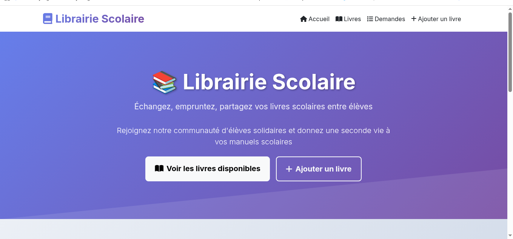

# 📚 Librairie Scolaire - Plateforme d'Échange de Livres

# 👨‍💻 Developpeur : MAHAFALE Mahaisoa 

- Email: mahahesjr@email.com


<div align="center">
  
  
  
  *✨ Interface moderne et responsive de la plateforme*
  
</div>

## 🎯 Présentation du Projet

**Librairie Scolaire** est une application web innovante développée avec **Symfony** qui permet aux élèves d'échanger, d'emprunter et de donner leurs livres scolaires. Notre mission : **rendre l'éducation accessible à tous** tout en promouvant une économie circulaire et solidaire.

### 🔧 Technologies Utilisées
| Technologie |	Version	| Usage |
|-------------|---------|-------|
|  Symfony	  |   6.3+	| Framework principal |
|    PHP	  |   8.2+	| Langage backend |
|   Twig	  |   3.0+	|        Templating |
|  Bootstrap  |	  5.3+	|    Framework CSS |
|    MySQL	  |    8.0+	|    Base de données |
|   Doctrine  |	  2.15+	|    ORM |


### 🌟 Fonctionnalités Principales

| Fonctionnalité | Description | 
|---------------|-------------|
| **📖 Gestion des Livres** | CRUD complet pour ajouter, modifier et supprimer des livres | 
| **🔄 Système de Prêt/Don** | Les élèves peuvent demander un livre en prêt ou en don | 
| **📍 Filtrage par Ville** | Trouvez des livres disponibles près de chez vous | 
| **📱 Design Responsive** | Interface optimisée pour tous les appareils | 
| **🎨 Interface Moderne** | Design professionnel avec Bootstrap 5 | 

## 🚀 Installation et Démarrage

### Prérequis
- PHP 8.2 ou supérieur
- Composer
- Symfony CLI
- MySQL/MariaDB ou SQLite ( Xampp/lampp )

### 📥 Lancement
```
# Cloner le projet
git clone https://github.com/MrSicario/Librairie_with_symfony.git
cd librairie-scolaire

#Installer les dépendances
composer install
npm install

# Copier le fichier d'environnement
cp .env .env.local

# Modifier DATABASE_URL dans .env.local
DATABASE_URL="mysql://root:@127.0.0.1:3306/librairie_scolaire?serverVersion=8.0"

#Compiler les assets
npm run build

# Démarrer le serveur Symfony et taper le lien dans le navigateur 
symfony server:start
http://localhost:8000/

# Ou avec PHP
php -S localhost:8000 -t public
```

## 🌟 Remerciements
- Symfony pour leur excellent framework
- La communauté Bootstrap pour les composants UI
- Tous les contributeurs et testeurs

<hr>
<div align="center">
⭐ N'oubliez pas de donner une étoile au projet si vous le trouvez utile !

"Partager la connaissance, c'est créer un avenir meilleur" 📚✨

</div>
